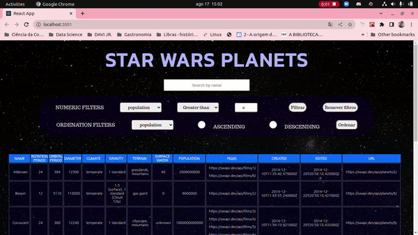

# <h1 align="center">⭐ STAR WARS PLANETS 🪐</h1>

<p align="center"></p>

## Descrição:

<p text-align="justify" >Este projeto envolve a construção de uma tabela contendo os planetas do universo Star Wars. A proposta foi requisitar dados da <a href="https://swapi.dev/" target="_blank">SWAPI</a> e estruturar uma tabela com a possibilidade de filtrar os planetas por suas características, tais como população, período orbital e diâmetro.</p>

## Escolha seu transpote favorito e clique para navegar até a página:

<a href="https://star-wars-planets-2dfcjchsw-airelribeiro.vercel.app/" target="_blank"></a>
<a href="https://star-wars-planets-2dfcjchsw-airelribeiro.vercel.app/" target="_blank"></a>
<a href="https://star-wars-planets-2dfcjchsw-airelribeiro.vercel.app/" target="_blank"></a>
<a href="https://star-wars-planets-2dfcjchsw-airelribeiro.vercel.app/" target="_blank"></a>

## Ferramentas utilizadas:

###

<div align="left">


<p text-align="justify">
O React é uma biblioteca JavaScript declarativa, que possibilitou a estruturação da página de forma mais simples e com uma interface amigável. Foi utilizado Context API, um recurso do React que permite compartilhar estado entre diversos componentes em uma árvore de componentes sem a necessidade de se passar props e callbacks manualmente entre eles; enquanto a construção desses estados foi possibilitada pelo uso dos React Hooks. A estilização da página foi feita com CSS.
</p>
</div>

###

## Rodando o projeto na sua máquina:

1. Escolha um diretório e clone o repositório utilizando **git clone**:
```
  git clone git@github.com:AirelRibeiro/star-wars-planet.git
```

2. Acesse o diretório do projeto e instale as dependências:
```
  cd star-wars-planets
  npm install
```

3. Então inicie usando o comando **npm start** no terminal e será aberta uma aba no seu navegador com a URL
```
http://localhost:3000/
```
